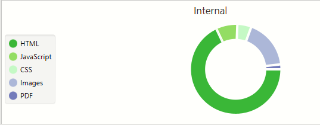
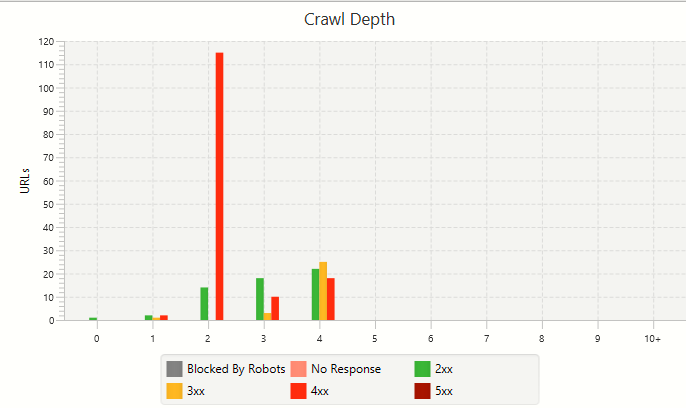
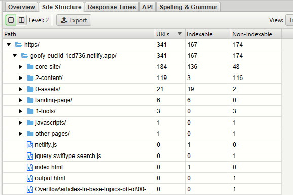

<script src="https://unpkg.com/react@15.6.1/dist/react.js"></script>
<script src="https://unpkg.com/react-dom@15.6.1/dist/react-dom.js"></script>
<link rel="stylesheet" type="text/css" href="https://unpkg.com/purecss@1.0.0/build/pure-min.css"/>
<style>body { color: red }</style>


[](https://app.netlify.com/sites/goofy-euclid-1cd736/deploys)
[](https://mybinder.org/v2/git/https%3A%2F%2Fgithub.com%2Fbgoonz%2Fweb-dev-notes-resource-site/HEAD)

[](https://github.com/bgoonz/web-dev-notes-resource-site/stargazers)

[](https://github.com/bgoonz/web-dev-notes-resource-site)

This is the repo that contains my resource sharing and blog site ... centered mostly on web development and just a bit of audio production / generally nerdy things I find interesting. Please feel free to give me constructive feedback or even to branch off and improve it as you see fit... or don't, no pressure 🤷‍♂️.

[](https://app.buddy.works/bryanguner/web-dev-notes-resource-site/pipelines/pipeline/304714)

<!-- PROJECT LOGO -->
<br />
<p align="center">
  <a href="https://github.com/github_username/repo_name">

    

  </a>

  <h3 align="center">Web-Dev-Resource-Hub</h3>

  <p align="center">

    project_description
    <br />
    <a href="https://github.com/github_username/repo_name"><strong>Explore the docs »</strong></a>
    <br />
    <br />
    <a href="https://github.com/github_username/repo_name">View Demo</a>
    ·
    <a href="https://github.com/github_username/repo_name/issues">Report Bug</a>
    ·
    <a href="https://github.com/github_username/repo_name/issues">Request Feature</a>

  </p>
</p>

<!-- TABLE OF CONTENTS -->
<details open="open">
  <summary><h2 style="display: inline-block">Table of Contents</h2></summary>
  <ol>

    <li>
      <a href="#about-the-project">About The Project</a>
      <ul>
        <li><a href="#built-with">Built With</a></li>
      </ul>
    </li>
    <li>
      <a href="#getting-started">Getting Started</a>
      <ul>
        <li><a href="#prerequisites">Prerequisites</a></li>
        <li><a href="#installation">Installation</a></li>
      </ul>
    </li>
    <li><a href="#usage">Usage</a></li>
    <li><a href="#roadmap">Roadmap</a></li>
    <li><a href="#contributing">Contributing</a></li>
    <li><a href="#license">License</a></li>
    <li><a href="#contact">Contact</a></li>
    <li><a href="#acknowledgements">Acknowledgements</a></li>

  </ol>
</details>


<!-- ABOUT THE PROJECT -->

## About The Project

[![Product Name Screen Shot][product-screenshot]](https://example.com)

Here's a blank template to get started:
**To avoid retyping too much info. Do a search and replace with your text editor for the following:**
`github_username` , `repo_name` , `twitter_handle` , `email` , `project_title` , `project_description`

### Built With

* []()
* []()
* []()

<!-- GETTING STARTED -->

## Getting Started

To get a local copy up and running follow these simple steps.

### Prerequisites

This is an example of how to list things you need to use the software and how to install them.

* npm

  

``` sh
  npm install npm@latest -g
  ```

### Installation

1. Clone the repo

   

``` sh
   git clone https://github.com/github_username/repo_name.git
   ```

2. Install NPM packages

   

``` sh
   npm install
   ```

<!-- USAGE EXAMPLES -->

## Usage

Use this space to show useful examples of how a project can be used. Additional screenshots, code examples and demos work well in this space. You may also link to more resources.

_For more examples, please refer to the [Documentation](https://example.com)_

<!-- ROADMAP -->

## Roadmap

See the [open issues](https://github.com/github_username/repo_name/issues) for a list of proposed features (and known issues).

<!-- CONTRIBUTING -->

## Contributing

Contributions are what make the open source community such an amazing place to be learn, inspire, and create. Any contributions you make are **greatly appreciated**.

1. Fork the Project
2. Create your Feature Branch (`git checkout -b feature/AmazingFeature`)
3. Commit your Changes (`git commit -m 'Add some AmazingFeature'`)
4. Push to the Branch (`git push origin feature/AmazingFeature`)
5. Open a Pull Request

<!-- LICENSE -->

## License

Distributed under the MIT License. See `LICENSE` for more information.

<!-- CONTACT -->

## Contact

Your Name - [@twitter_handle](https://twitter.com/twitter_handle) - email

Project Link: [https://github.com/github_username/repo_name](https://github.com/github_username/repo_name)

<!-- ACKNOWLEDGEMENTS -->

## Acknowledgements

* []()
* []()
* []()

<!-- MARKDOWN LINKS & IMAGES -->
<!-- https://www.markdownguide.org/basic-syntax/#reference-style-links -->
[contributors-shield]: https://img.shields.io/github/contributors/github_username/repo.svg?style=for-the-badge
[contributors-url]: https://github.com/github_username/repo/graphs/contributors
[forks-shield]: https://img.shields.io/github/forks/github_username/repo.svg?style=for-the-badge
[forks-url]: https://github.com/github_username/repo/network/members
[stars-shield]: https://img.shields.io/github/stars/github_username/repo.svg?style=for-the-badge
[stars-url]: https://github.com/github_username/repo/stargazers
[issues-shield]: https://img.shields.io/github/issues/github_username/repo.svg?style=for-the-badge
[issues-url]: https://github.com/github_username/repo/issues
[license-shield]: https://img.shields.io/github/license/github_username/repo.svg?style=for-the-badge
[license-url]: https://github.com/github_username/repo/blob/master/LICENSE.txt
[linkedin-shield]: https://img.shields.io/badge/-LinkedIn-black.svg?style=for-the-badge&logo=linkedin&colorB=555
[linkedin-url]: https://linkedin.com/in/github_username






---
---


---
---

> https://goofy-euclid-1cd736.netlify.app/0-assets/planning/documentation/portfolio/tree-diagram.html


---

``` 
\___________________________________________________
bryan_dir:Stable_exitstatus:130 ====>

tree -d -L 4 > README.md

.
├── 0-assets
│   ├── 0-embeded-repos
│   │   ├── Resource-Hub-Mark_II-master
│   │   │   ├── PUBLIC
│   │   │   ├── assets
│   │   │   ├── documentation
│   │   │   └── landing-page
│   │   └── code-mirror
│   │       ├── bin
│   │       ├── demo
│   │       ├── doc
│   │       ├── keymap
│   │       ├── lib
│   │       ├── test
│   │       └── theme
│   ├── blog-styles
│   │   └── output
│   │       ├── bootstrap3
│   │       ├── jasonm23-dark
│   │       ├── jasonm23-foghorn
│   │       ├── jasonm23-markdown
│   │       ├── jasonm23-swiss
│   │       ├── markedapp-byword
│   │       ├── mixu-book
│   │       ├── mixu-bootstrap
│   │       ├── mixu-bootstrap-2col
│   │       ├── mixu-gray
│   │       ├── mixu-page
│   │       ├── mixu-radar
│   │       ├── plain
│   │       ├── plain.html
│   │       ├── roryg-ghostwriter
│   │       ├── thomasf-solarizedcssdark
│   │       └── thomasf-solarizedcsslight
│   ├── css
│   ├── images
│   │   ├── horizontal lines
│   │   ├── interesting
│   │   ├── interesting.html
│   │   └── windows-icons.html
│   ├── js
│   ├── planning
│   │   └── documentation
│   │       └── portfolio
│   └── videos
├── 1-tools
│   ├── TOOLHUB
│   │   ├── ajax.googleapis.com
│   │   │   └── ajax
│   │   ├── cdn.jsdelivr.net
│   │   │   └── handsontable
│   │   ├── code.jquery.com
│   │   │   └── ui
│   │   └── tools
│   │       ├── cat
│   │       ├── css
│   │       ├── helpers
│   │       ├── img
│   │       ├── js
│   │       ├── tool
│   │       ├── tools_files
│   │       └── vendor
│   ├── ZUMZI-LIVE-CHAT
│   │   ├── backend
│   │   └── web
│   │       ├── assets
│   │       ├── mesibo
│   │       ├── scripts
│   │       ├── styles
│   │       └── third-party
│   ├── file-conversions
│   ├── file-conversions.html
│   ├── file-manager-js-master
│   │   ├── lib
│   │   │   ├── createDir
│   │   │   ├── createDir.html
│   │   │   ├── createFile
│   │   │   ├── createFile.html
│   │   │   ├── dirSize
│   │   │   ├── dirSize.html
│   │   │   ├── exists
│   │   │   ├── exists.html
│   │   │   ├── info
│   │   │   ├── info.html
│   │   │   ├── list
│   │   │   ├── list.html
│   │   │   ├── listDeep
│   │   │   ├── listDeep.html
│   │   │   ├── readFile
│   │   │   ├── readFile.html
│   │   │   ├── removeDir
│   │   │   ├── removeDir.html
│   │   │   ├── removeFile
│   │   │   ├── removeFile.html
│   │   │   ├── rename
│   │   │   ├── rename.html
│   │   │   ├── stat
│   │   │   └── stat.html
│   │   ├── notes
│   │   ├── notes.html
│   │   └── test
│   │       └── fixtures
│   ├── general-util
│   │   ├── has-own-prop
│   │   └── is-promise
│   ├── live-form
│   │   └── node_modules.html
│   │       └── jquery
│   ├── node-npm
│   │   └── npm.broofa.com
│   │       ├── js
│   │       └── vendor
│   └── site-building
│       ├── Convert-arr-2-atags
│       ├── Convert-arr-2-atags.html
│       ├── convert-multi-line-2-js
│       ├── convert-multi-line-2-js.html
│       ├── create-folder-for-every-file
│       ├── create-folder-for-every-file.html
│       ├── extractcss-master
│       │   ├── extractCSS - Online CSS Extractor_files
│       │   ├── extractCSS - Online CSS Extractor_files.html
│       │   ├── extractcss-master
│       │   ├── lib
│       │   └── lib.html
│       ├── html-gen-dir
│       ├── html-gen-dir.html
│       ├── read-dir-create-a
│       └── read-dir-create-a.html
├── 2-content
│   ├── core-content
│   │   ├── Data-Structures
│   │   │   ├── 1-Python
│   │   │   ├── HTML-only
│   │   │   └── _0-JS
│   │   ├── Projects
│   │   │   ├── JSX
│   │   │   ├── amusement-park-tracker-solution
│   │   │   ├── data-driven app
│   │   │   ├── express-reading-list-solution
│   │   │   ├── formative_forms_solution
│   │   │   ├── grocery-store-solution
│   │   │   ├── guessing-game-project-master
│   │   │   ├── routing_project_solution
│   │   │   ├── star-trek-solution
│   │   │   ├── triviaProject
│   │   │   └── twitterClone-Solution
│   │   ├── USEFUL
│   │   │   └── blog-posts
│   │   ├── blog-posts
│   │   │   ├── html
│   │   │   └── vscode
│   │   ├── cheat-sheets
│   │   │   └── pdf
│   │   ├── ciriculumn
│   │   │   ├── Extra
│   │   │   ├── _Summary
│   │   │   ├── images
│   │   │   ├── images.html
│   │   │   ├── week-1
│   │   │   ├── week-10
│   │   │   ├── week-11
│   │   │   ├── week-12
│   │   │   ├── week-13
│   │   │   ├── week-14
│   │   │   ├── week-15
│   │   │   ├── week-16
│   │   │   ├── week-17
│   │   │   ├── week-18
│   │   │   ├── week-2
│   │   │   ├── week-3
│   │   │   ├── week-4
│   │   │   ├── week-5
│   │   │   ├── week-6
│   │   │   ├── week-7
│   │   │   ├── week-8
│   │   │   └── week-9
│   │   ├── database
│   │   │   ├── psql
│   │   │   └── sql-primer
│   │   ├── live-examples
│   │   │   ├── css-examples
│   │   │   ├── dom-examples
│   │   │   ├── fetch-examples
│   │   │   ├── fonts
│   │   │   ├── html-examples
│   │   │   ├── js-examples
│   │   │   ├── media
│   │   │   ├── perf-examples
│   │   │   ├── web-components-examples
│   │   │   ├── webapi-examples
│   │   │   ├── webaudio-examples
│   │   │   └── webextensions-examples
│   │   ├── misc
│   │   │   └── LINKS
│   │   ├── node-npm
│   │   │   ├── docs
│   │   │   └── npm-reademe-comp
│   │   ├── temp
│   │   │   ├── link-city
│   │   │   └── utils
│   │   └── work-life
│   │       ├── tet
│   │       └── www.atlassian.com
│   └── media
│       └── bryan-ig
├── core-site
│   ├── css
│   ├── experimental
│   │   └── draft-fb-js
│   ├── fonts
│   │   └── windows
│   ├── images
│   │   ├── aux-images
│   │   └── prettyPhoto
│   │       ├── dark_rounded
│   │       ├── dark_square
│   │       ├── default
│   │       ├── light_rounded
│   │       └── light_square
│   ├── js
│   │   └── vendor
│   ├── other-pages
│   │   ├── 0-projects
│   │   │   ├── calendar-this-solution
│   │   │   ├── css-flexbox-trello-master
│   │   │   ├── react-context
│   │   │   ├── web-audio-api-ajax
│   │   │   └── web-audio-recorder
│   │   ├── Cheat-Sheets
│   │   ├── Markdown
│   │   ├── Quizes
│   │   │   ├── bash
│   │   │   ├── c++
│   │   │   ├── css
│   │   │   ├── git
│   │   │   ├── html
│   │   │   ├── javascript
│   │   │   ├── jquery
│   │   │   ├── matlab
│   │   │   ├── microsoft-excel
│   │   │   ├── microsoft-word
│   │   │   ├── node.js
│   │   │   ├── python
│   │   │   └── react
│   │   ├── Repo.js-master
│   │   │   └── fonts
│   │   ├── Student-Profiles
│   │   │   ├── assets
│   │   │   ├── build
│   │   │   ├── feedbackform
│   │   │   ├── images
│   │   │   └── videos
│   │   ├── Web-Dev-Setup
│   │   ├── best-prac-extension-guide
│   │   │   └── Design-Principles
│   │   ├── blog-posts
│   │   │   ├── 0-CSS
│   │   │   ├── 0-images
│   │   │   ├── 0-projects
│   │   │   ├── 9-thigs-you-should-know-about
│   │   │   ├── Cheat-Sheets
│   │   │   ├── Markdown
│   │   │   ├── Quizes
│   │   │   ├── Student-Profiles
│   │   │   ├── Web-Dev-Setup
│   │   │   ├── _MISC
│   │   │   ├── best-prac-extension-guide
│   │   │   ├── blog
│   │   │   ├── git-workflow
│   │   │   └── tools-of-the-trade
│   │   ├── documentation
│   │   │   ├── excel
│   │   │   └── new
│   │   ├── tools-of-the-trade
│   │   └── weeks
│   │       ├── 0-quiz
│   │       ├── Images
│   │       ├── solution
│   │       ├── week-1
│   │       ├── week-10
│   │       ├── week-11
│   │       ├── week-5
│   │       ├── week-8
│   │       └── week-9
│   ├── testing
│   │   ├── interactive
│   │   └── src
│   └── upload
│       └── double-bubble-outline
├── landing-page
│   ├── dist
│   │   ├── css
│   │   ├── images
│   │   └── js
│   └── src
│       ├── images
│       ├── js
│       └── scss
│           ├── abstracts
│           ├── base
│           ├── components
│           └── layout
└── temp

304 directories
```
